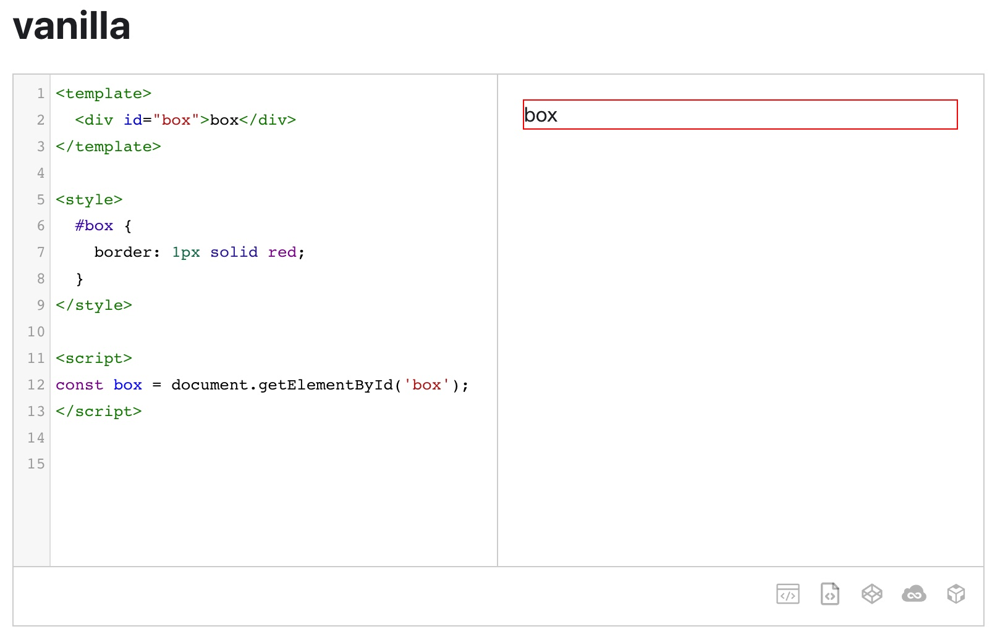
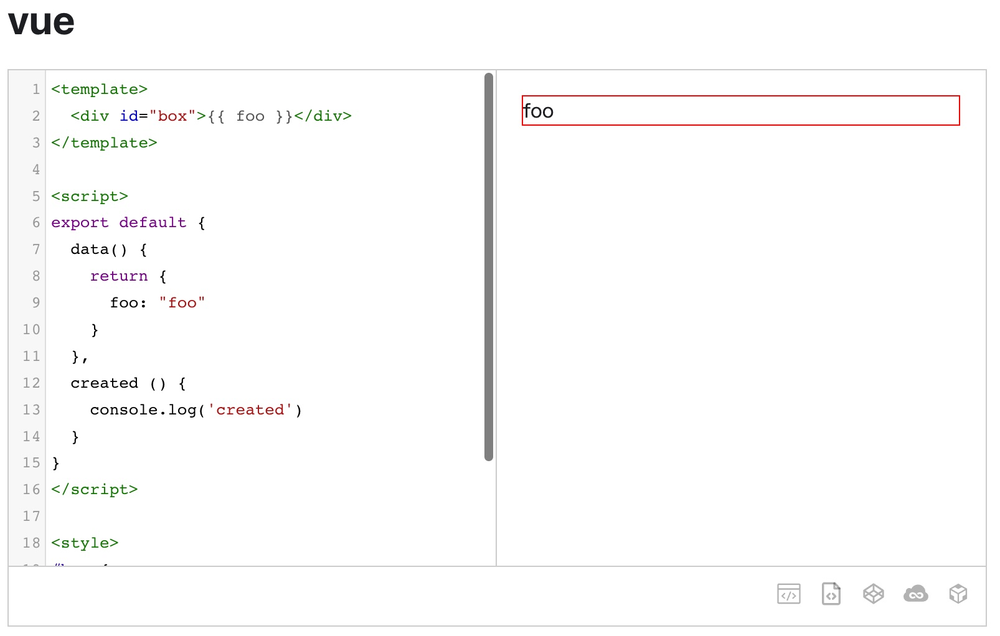
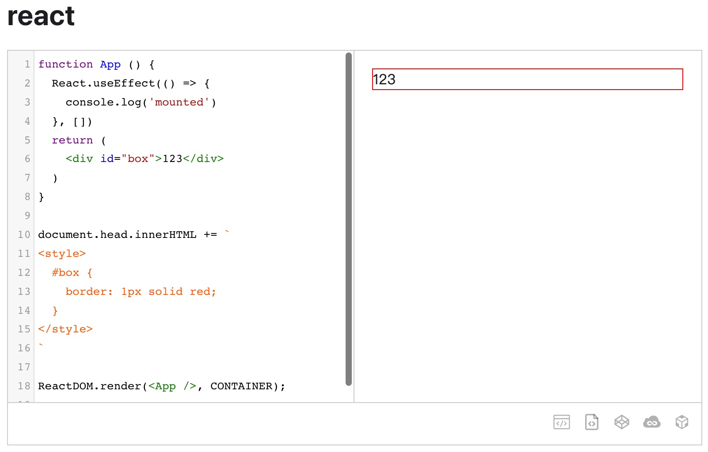

# docusaurus-plugin-demo-block
> Use code blocks as usual and get better rendering


## Install

```
npm i docusaurus-plugin-demo-block
```

## Quick Start

```js
  plugins: [
    [
      'demo-block',
      /** @type {import('./lib/option-type').Options} */
      ({}),
    ],
  ],
```

## Example





## Config

you can look this [config](./src/types/option-type.d.ts) file to find which config is supported

### global config

```js
  plugins: [
    [
      'demo-block',
      /** @type {import('./lib/option-type').Options} */
      ({ babel: false }),
    ],
  ],
```

### local config

```
\```html vanilla babel=false
<template>
  <div id="box">box</div>
</template>

<style>
  #box {
    border: 1px solid red;
  }
</style>

<script>
var box = document.getElementById('box');
</script>

\```
```

## Docs

https://xiguaxigua.com/docusaurus-plugin-demo-block

## Contributing

[Contributing](./CONTRIBUTING.md)

## License

[MIT](./LICENSE)